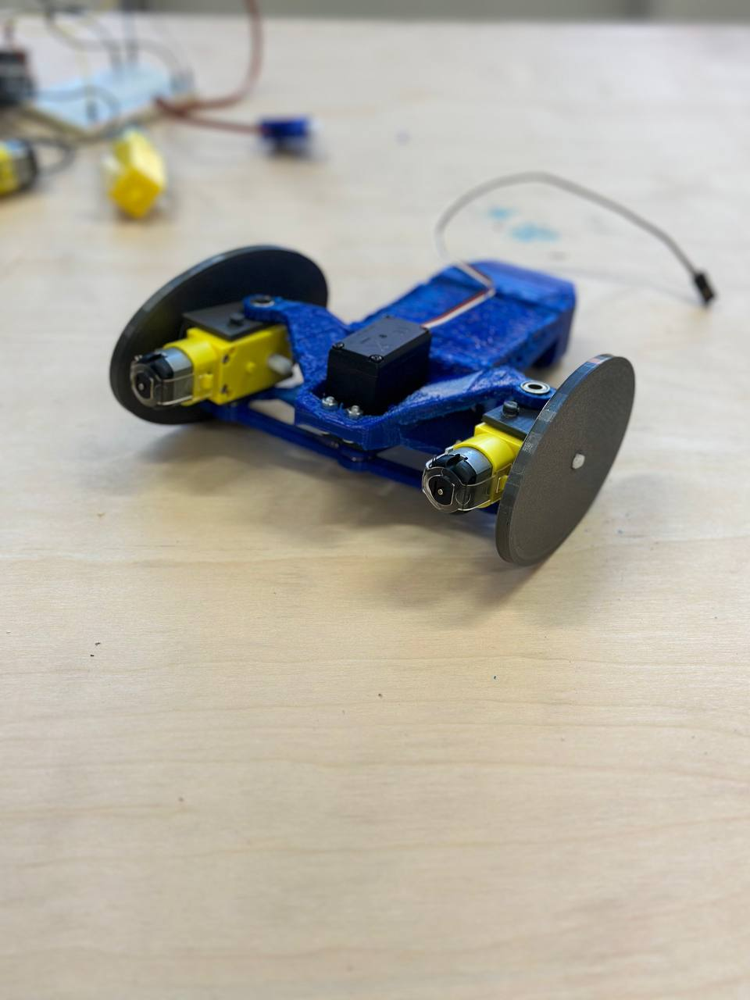

# Радиоуправляемый робот
* [Описание проекта](#chapter-0)
* [Папки проекта](#chapter-1)
* [Схема подключения](#chapter-2)
* [Материалы и компоненты](#chapter-3)
* [Как скачать и прошить](#chapter-4)
* [Зависимости](#chapter-5)

## Описание проекта
Робот с колесами искривленной формы для участия в забеге:
- Преодолеть бассейн с машмеллоу
- Преодолеть рампу
- Тоннель, открыть выходную дверь с помощью подсветки
- Лопнуть шарик

## Папки
- **CAD** - содержит файлы CAD системы для дальнейшей печати на 3D принтере 
- **Project** - исходные коды, прошивка, мейкфайлы для сборки и документацию([инструкция](#chapter-4)) 
  - **Bot** - исходые коды для робота
  - **ControlPanel** - исходые коды пульта управления
  - **Doc** - дополнительная документация про провекту

## Схема

## Материалы и компоненты
* 2 Arduino UNO 
* 2 мотора
* 2 сервопривода
* Макетная плата и провода
* радиоприемник и радиопередатчик
* батарейки/аккумуляторы

## Как скачать и прошить
* Скачать архив с проектом
* Установить библиотеки в  
`C:\Program Files (x86)\Arduino\libraries\` (Windows x64)  
`C:\Program Files\Arduino\libraries\` (Windows x86)
* Подключить Ардуино к компьютеру
* Настроить мейкфайлы: COM порт и модель Arduino можно узнать командой "make list"
* Настроить что нужно по проекту
* Загрузить прошивку: "make program"
* Пользоваться  

## Зависимости
- **microLED** - библиотека для работы со светодиодной лентой
- **Servo** - библиотека для работы с сервоприводами
- **RF24** - библиотека для работы с радио
